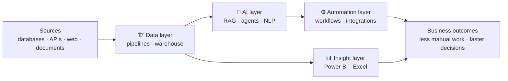

  

  

  
  
  

---

### 👋 About me

I help businesses turn scattered data into **reliable pipelines**, **AI that answers questions**, **automations that remove manual work**, and **dashboards leaders actually use**.

🔧 Currently building production data pipelines for a retail data platform with Python, PostgreSQL and Apache Airflow.

### 🎯 Client problems I solve

| | Your problem | What I build | What you get |
|:-:|---|---|---|
| 🏗️ | Data is scattered across systems and the numbers don't match | A central warehouse with tested, governed pipelines | One source of truth everyone trusts |
| 🧠 | Answers are buried in documents, PDFs and emails | A RAG assistant over your documents and data that cites its sources | Answers in one question, not hours of searching |
| 🧠 | Reviews, tickets and feedback pile up unread | NLP pipelines for classification, sentiment and entity extraction | Issues and trends surface automatically |
| ⚙️ | Staff copy data between systems and download reports by hand | Scheduled automations, API integrations and AI agents | Hours of repetitive work handed to software |
| 📊 | Leadership waits on reports rebuilt by hand every week | Automated Power BI KPI dashboards | Reports refresh on their own and decisions come faster |
| 📊 | Excel workbooks are slow, fragile and error-prone | Power Query, Power Pivot and VBA automation | Workbooks that refresh in one click |

### 🧩 How it fits together

### 🛠️ What I work with

<table>
<tr>
<td width="50%" valign="top">

#### 🏗️ Data layer
*Reliable data, ready for AI and reporting*

- Batch and streaming pipelines with incremental loads
- Warehouses in bronze, silver and gold layers with star-schema models
- Airflow orchestration with retries, monitoring and backfills
- Data quality tests, governance and lineage

</td>
<td width="50%" valign="top">

#### 🧠 AI layer
*Ask questions of your data and documents*

- Document ingestion, chunking and embedding pipelines
- RAG with hybrid search, reranking and cited answers
- AI agents with tool calling and memory
- NLP: classification, sentiment, entity extraction, summarization

</td>
</tr>
<tr>
<td width="50%" valign="top">

#### ⚙️ Automation layer
*Hand repetitive work to software*

- Scheduled Python workflows with monitoring and alerts
- Browser automation and web scraping
- API integrations that move data between systems
- AI agents that read documents, extract data and trigger the next step

</td>
<td width="50%" valign="top">

#### 📊 Insight layer
*Decisions from dashboards, not spreadsheets*

- Power BI data models, DAX measures and KPI dashboards
- Power Query for repeatable data shaping
- Excel: Power Pivot, pivot tables and advanced formulas
- Report automation with VBA and macros

</td>
</tr>
</table>

### 🤝 Let's work together

Have a problem like the ones above? [Email me](mailto:omarshalaby.data@gmail.com) or message me on [LinkedIn](https://www.linkedin.com/in/omarshalaby1/).

