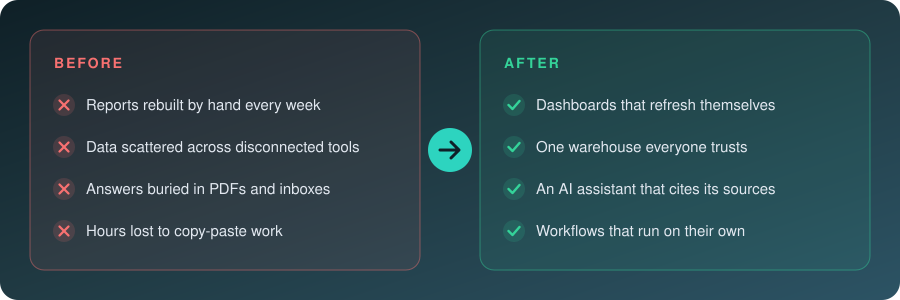
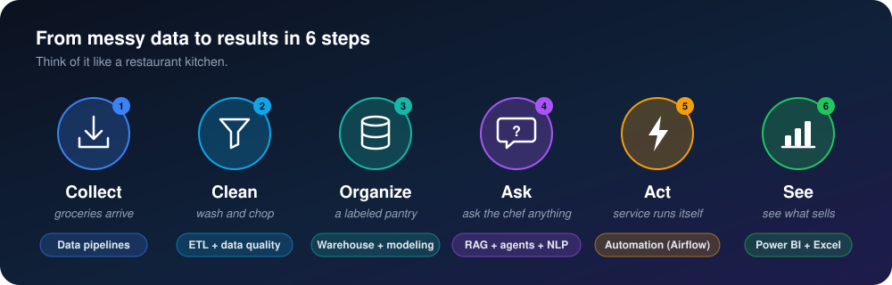
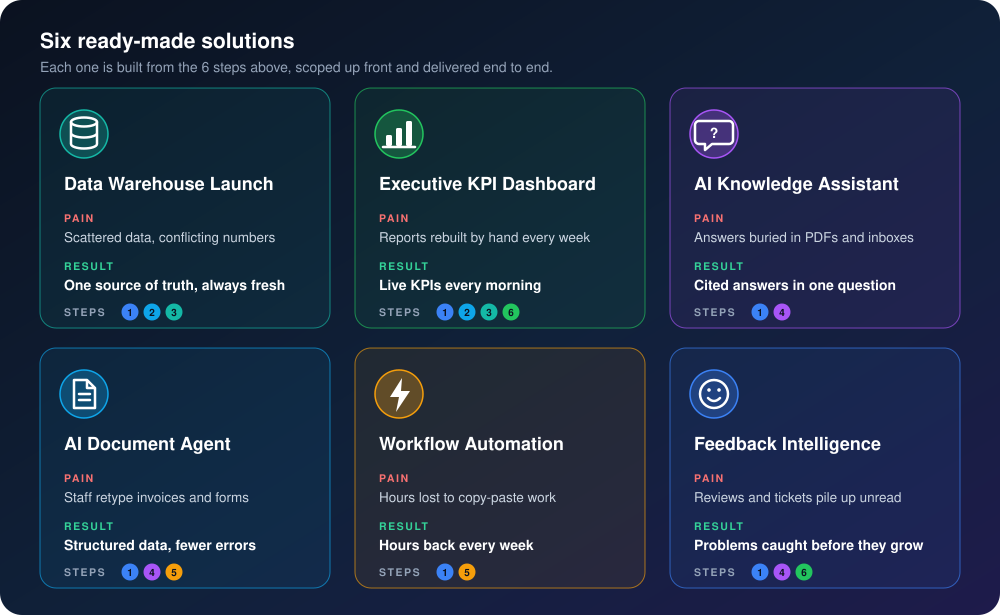
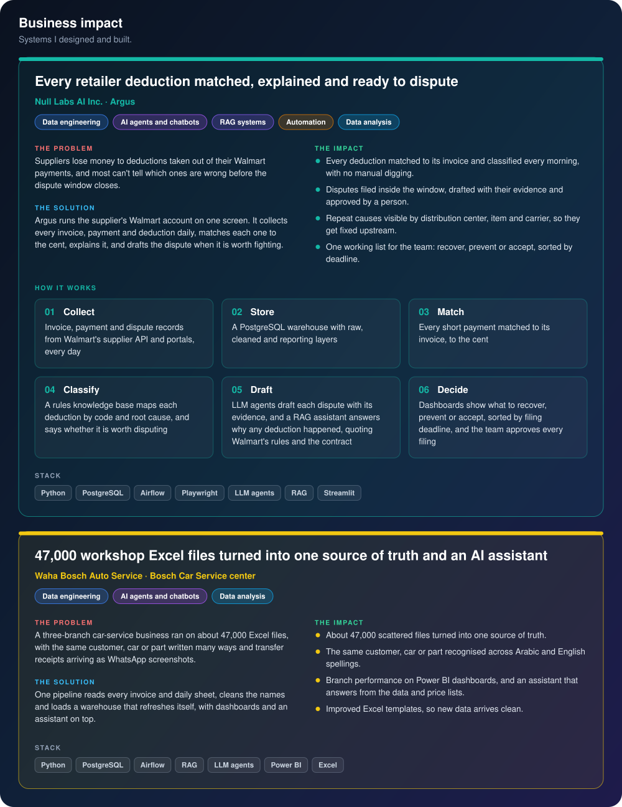
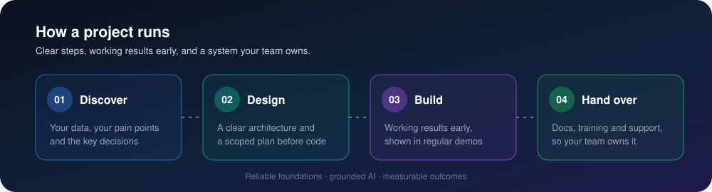
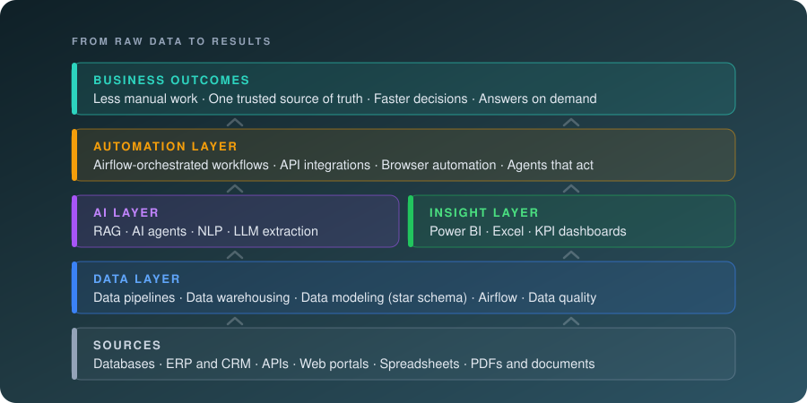

  

  

  
  
  

<h3 align="center">I turn scattered business data into AI, automation and dashboards that save your team hours and sharpen every decision.</h3>

<b>Domain expertise:</b> retail supply chain (supplier invoicing, purchase orders, retailer deductions, freight and logistics charges) and automotive service operations.

  
  
  
  
  
  
  
  
  
  
  
  

## 🔍 The problem

  

## 🧠 The idea, in 6 steps

  

## 📦 What I deliver

  

  <b>Built for:</b>&nbsp;
  
  
  
  
  
  

## ⭐ Featured projects

  

## 🚀 How we work together

  

## 💡 Why me

- ✅ **Production-grade, not demos:** tested, monitored and documented to run every day.
- ✅ **End to end:** one engineer from raw data to AI, automation and dashboards.
- ✅ **Business first:** I start from the decision you need to make, then pick the tools.
- ✅ **You own it:** clean code and documentation your team can run without me.

## 🧩 Under the hood

For technical readers: the same 6 steps as a system, the tools behind it, and every skill.

  

### 💻 Tech stack

<h4 align="center">🗄️ Languages and databases</h4>

  &nbsp;&nbsp;
  &nbsp;&nbsp;
  &nbsp;&nbsp;
  &nbsp;&nbsp;
  &nbsp;&nbsp;
  &nbsp;&nbsp;
  &nbsp;&nbsp;
  &nbsp;&nbsp;
  &nbsp;&nbsp;

<h4 align="center">🏗️ Data engineering and big data</h4>

  &nbsp;&nbsp;
  &nbsp;&nbsp;
  &nbsp;&nbsp;
  &nbsp;&nbsp;
  &nbsp;&nbsp;
  &nbsp;&nbsp;

<h4 align="center">☁️ Cloud</h4>

  &nbsp;&nbsp;
  &nbsp;&nbsp;
  &nbsp;&nbsp;
  &nbsp;&nbsp;

<h4 align="center">🧠 AI, LLMs and NLP</h4>

  &nbsp;&nbsp;
  &nbsp;&nbsp;
  &nbsp;&nbsp;
  &nbsp;&nbsp;
  &nbsp;&nbsp;
  &nbsp;&nbsp;
  &nbsp;&nbsp;
  &nbsp;&nbsp;
  &nbsp;&nbsp;
  &nbsp;&nbsp;
  &nbsp;&nbsp;

<h4 align="center">⚙️ Automation</h4>

  &nbsp;&nbsp;
  &nbsp;&nbsp;
  &nbsp;&nbsp;
  &nbsp;&nbsp;

<h4 align="center">📊 BI and analytics</h4>

  &nbsp;&nbsp;
  &nbsp;&nbsp;
  &nbsp;&nbsp;

<h4 align="center">🛠️ Tools</h4>

  &nbsp;&nbsp;
  &nbsp;&nbsp;
  &nbsp;&nbsp;
  &nbsp;&nbsp;

<b>📚 Full skill map: 13 areas from my training (click to open)</b>

 

<b>🗄️ Databases and SQL</b>

- Relational design: ERDs, keys, constraints and normalization
- SQL: DDL, DML, joins, subqueries, CTEs and aggregations
- Performance: indexing, execution plans, partitioning and query tuning
- NoSQL data modeling, CAP theorem and replication

<b>🏗️ Data warehousing and data modeling</b>

- OLTP vs OLAP; data warehouse, data lake and lakehouse
- Dimensional modeling: fact tables, dimensions, grain, slowly changing dimensions
- Star and snowflake schemas, and when to use each
- Layered warehouses: staging, core and presentation (bronze, silver, gold)
- Materialized views and aggregates for fast reporting
- dbt: staging, intermediate and mart models, tests, docs and lineage

<b>🔄 Data pipelines and orchestration</b>

- ETL vs ELT; full vs incremental loads
- Extraction from databases, files and REST APIs
- Apache Airflow: DAG design, operators, scheduling, retries, monitoring and logging
- End-to-end batch and streaming pipelines with Kafka, Spark and Airflow

<b>☁️ Cloud and big data</b>

- Azure Data Lake Storage and Blob Storage, file formats
- Azure Data Factory: pipelines, linked services, datasets and triggers
- Azure Databricks and Apache Spark: DataFrames, Spark SQL, caching and partitioning
- Hadoop: HDFS, YARN and MapReduce
- Kafka: topics, partitions, consumer groups, delivery guarantees, Kafka Streams

<b>🧹 Data quality and governance</b>

- Data quality checks, validation and handling bad data
- Data cataloging, lineage and metadata management
- Data ownership, security, access control and compliance

<b>🐍 Python for data</b>

- pandas and NumPy for cleaning and transformation
- REST APIs with requests and JSON parsing; automation scripts and scheduling
- asyncio and aiohttp, dataclasses and Pydantic validation
- FastAPI: async APIs, WebSockets, background tasks, streaming and Docker deployment

<b>🧠 LLMs, prompting and RAG</b>

- Transformers, tokens, embeddings, context windows and sampling (temperature, top-k, top-p)
- Prompt engineering: zero-shot, few-shot, ReAct and structured JSON output
- RAG: parsing, chunking, metadata, hybrid search (dense + BM25), reranking, query rewriting and citations
- Vector databases: Qdrant, Pinecone, Weaviate, pgvector, FAISS and Milvus
- AI inside data pipelines: NER, OCR and document parsing with Docling and Ollama

<b>🤖 AI agents and MCP</b>

- LangChain chains, retrievers and memory; LangGraph state graphs and conditional routing
- Tool and function calling with schemas, structured I/O and error handling
- Planning, ReAct loops, reflection and human-in-the-loop
- Multi-agent systems: supervisor, sequential and parallel
- Model Context Protocol (MCP): clients, servers, tools and custom servers

<b>🔤 NLP and deep learning</b>

- Text preprocessing, Bag of Words, TF-IDF and n-grams
- POS tagging and named entity recognition with NLTK and spaCy
- Word2Vec, GloVe, RNNs and LSTMs
- BERT, GPT and T5 with Hugging Face; fine-tuning for classification
- Summarization, translation, question answering and zero-shot classification
- Generative models: autoencoders, VAEs, GANs and diffusion

<b>🚀 LLMOps, serving and evaluation</b>

- Fine-tuning: SFT, LoRA and QLoRA with Hugging Face Trainer; quantization
- Evaluation: faithfulness, groundedness, golden datasets, RAGAS, DeepEval, BLEU, ROUGE, BERTScore
- Observability: tracing, token cost and latency with LangSmith, Langfuse and MLflow
- Serving with Ollama, vLLM and Hugging Face TGI behind OpenAI-compatible endpoints
- GenAI security: prompt injection, jailbreaks, RAG poisoning and PII protection
- Multimodal: vision-language models, OCR, speech-to-text and text-to-speech

<b>⚙️ Automation</b>

- Airflow-scheduled workflows with retries, monitoring and alerts
- Browser automation and web scraping with Playwright, Selenium and Beautiful Soup
- API integrations that move data between systems
- AI agents and AI coding agents that take the next step automatically

<b>📊 Power BI</b>

- Power Query (M) for cleaning and shaping data
- Star-schema models, relationships and cardinality
- DAX: CALCULATE, filter context, variables and time intelligence
- Dashboard design: drill-through, bookmarks and tooltips
- Row-level security, publishing and scheduled refresh in Power BI Service

<b>📈 Excel</b>

- XLOOKUP, INDEX/MATCH and dynamic arrays
- PivotTables and PivotCharts
- Power Query and Power Pivot with DAX
- Interactive dashboards, data validation and conditional formatting
- VBA and macros for report automation

## 🤝 Let's work together

<b>Ready to stop doing work by hand?</b>

  
  

  

